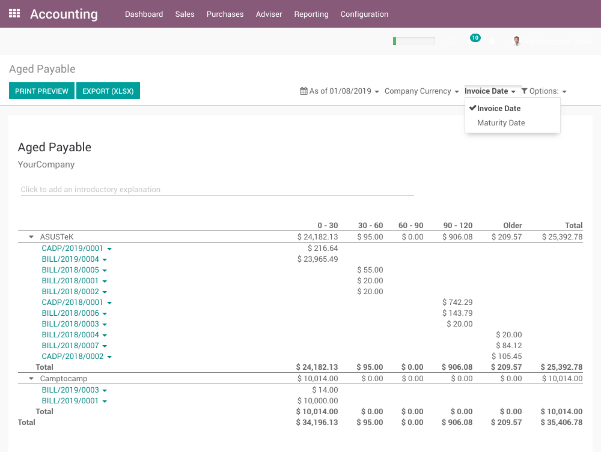
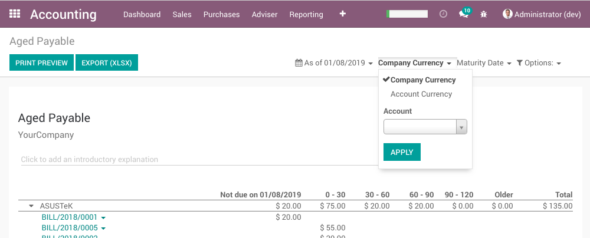
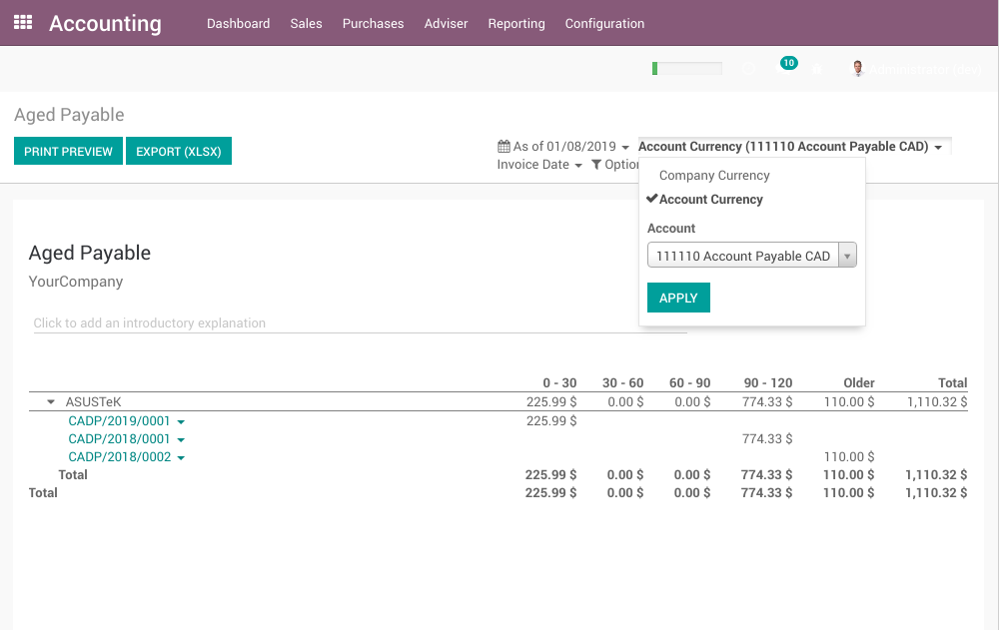

Aged Partner Balance Invoice Date
=================================
This module allows generating the receivable and payable partner balances
based on the invoice date instead of the maturity date.

It also adds the option to display the report in a foreign currency.

These 2 functionnalities are coupled, because, some banks demand the aged balance
per currency and in the basis of the invoice date.

Invoice Date
------------
The module enables displaying the report based on the invoice date instead of the due date.

With this option enabled, the `Not due on ...` column disapears.
Each date range (1 - 30, 31 - 60, etc) now refers to the date of the invoice instead of the payment due date.

Company Currency
----------------
The report can be displayed in the currency of the company.
This is the standard behavior of the report in a Vanilla Odoo.

Account Currency
----------------
The report can be displayed in the currency of a selected account.

Suppose your company is based in United States and you have 2 payable accounts: one USD and one CAD.
Your bank requires your payable aged balance for the US purchases separate from your CAD purchases.

To produce the report only for CAD purchases:

* Select `Account Currency`.
* In the `Account` field, select your CAD payable account.
* Click on `Apply`

The same method can be used to produce the report for USD purchases.

Contributors
------------
* Numigi (tm) and all its contributors (https://bit.ly/numigiens)

More information
----------------
* Meet us at https://bit.ly/numigi-com
