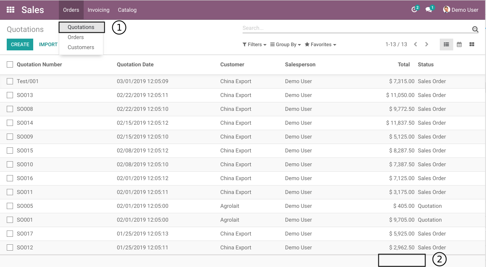
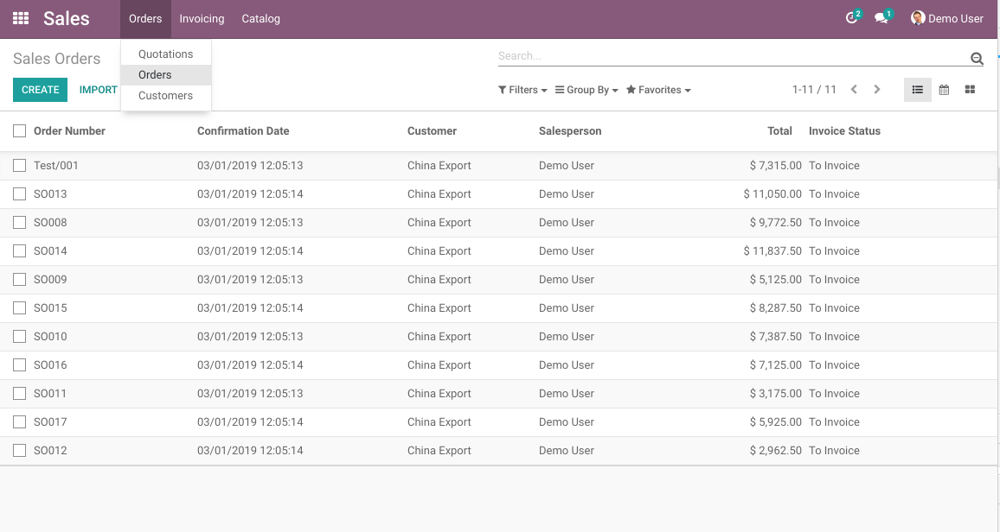
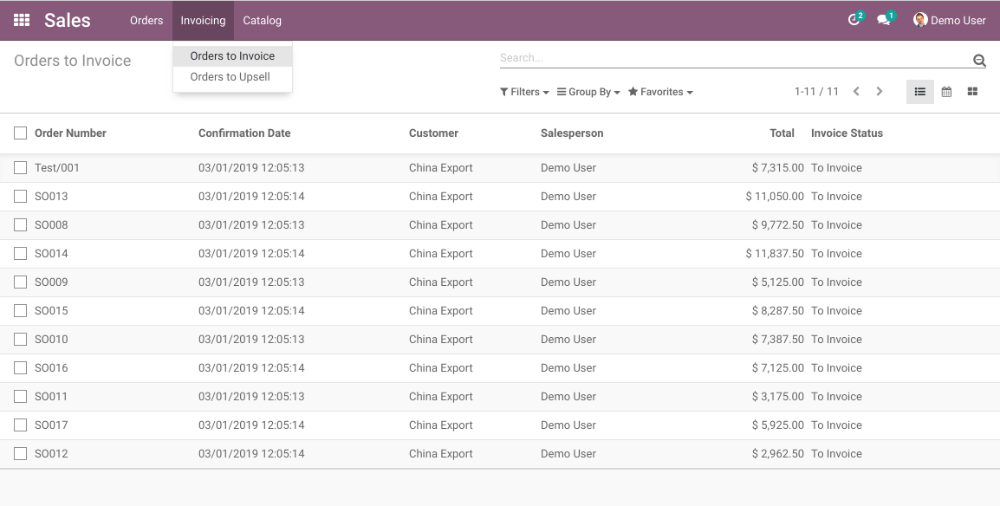
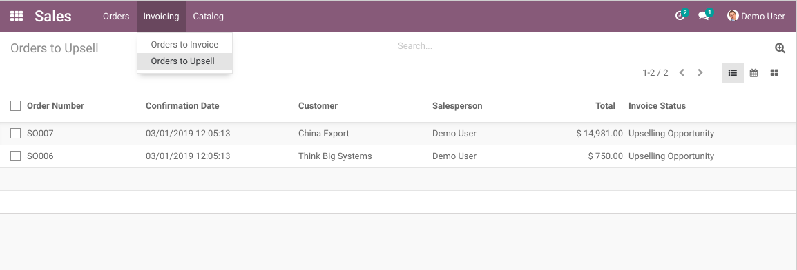
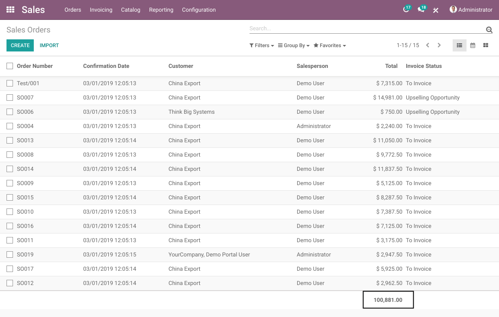
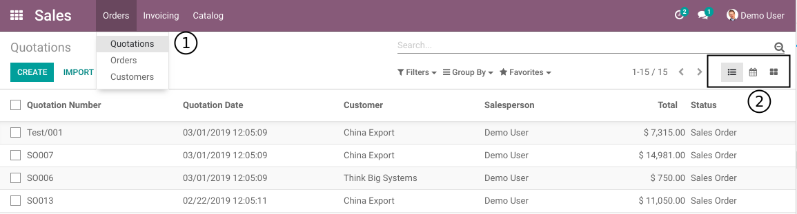
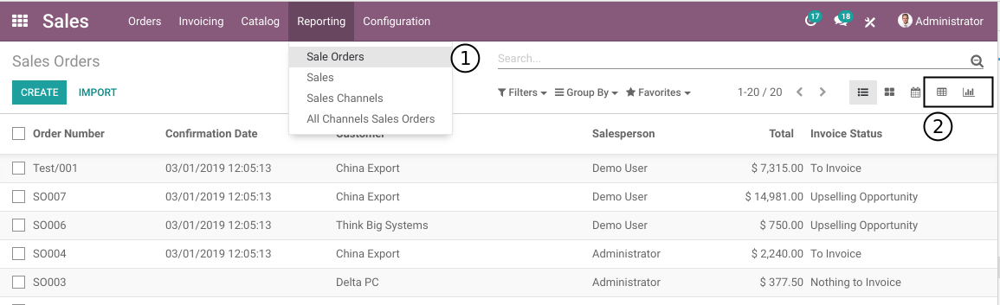

Sale Total Hidden
=================
This module hides the sale order totals.

Sale Order Totals
-----------------
As member of the group `Sales / User: Own Documents Only`, I go to `Sales / Orders / Quotations`.

In the bottom of the column `Total`, the sum of totals is hidden.

The same applies to the list views from the following menu entries:

* `Sales / Orders / Orders`

* `Sales / Orders / Orders to Invoice`

* `Sales / Orders / Orders to Upsell`

However, as member of the group `Sales / User: All Documents`, I am able to see the sum of totals.

Graph and Pivot
---------------
As member of the group `Sales / User: Own Documents Only`, in the list view of quotations,
I do not find the graph and pivot view options.

I only see the list, calendar and kanban views.

The same applies to the following list views:

* `Sales / Orders / Orders`
* `Sales / Orders / Orders to Invoice`
* `Sales / Orders / Orders to Upsell`

However, as member of the group `Sales / User: All Documents`,
I am able to see the pivot and graph views under `Sales / Reporting / Sale Orders`.

Contributors
------------
* Numigi (tm) and all its contributors (https://bit.ly/numigiens)

More information
----------------
* Meet us at https://bit.ly/numigi-com
